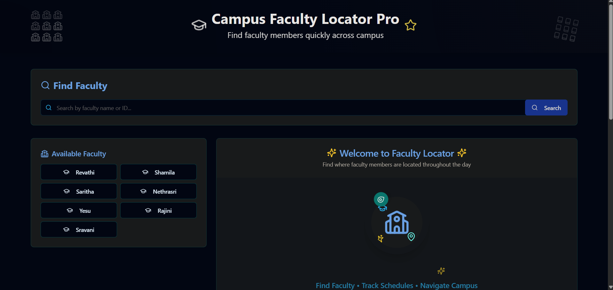
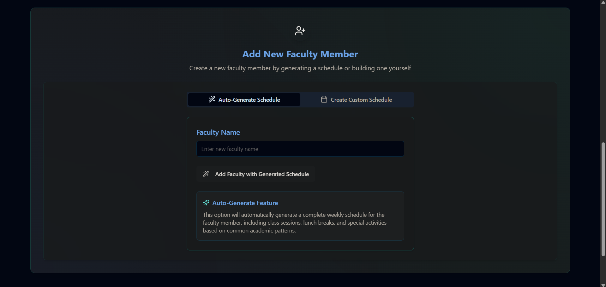
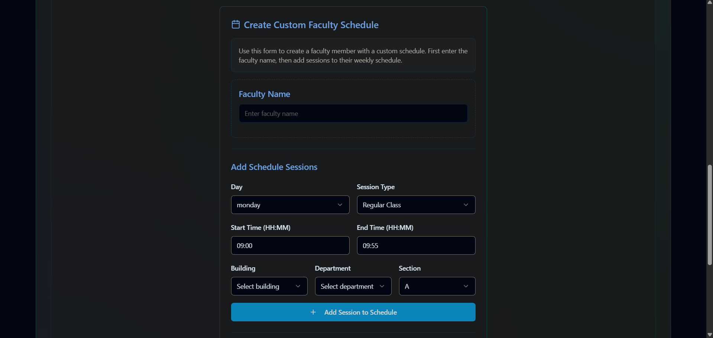
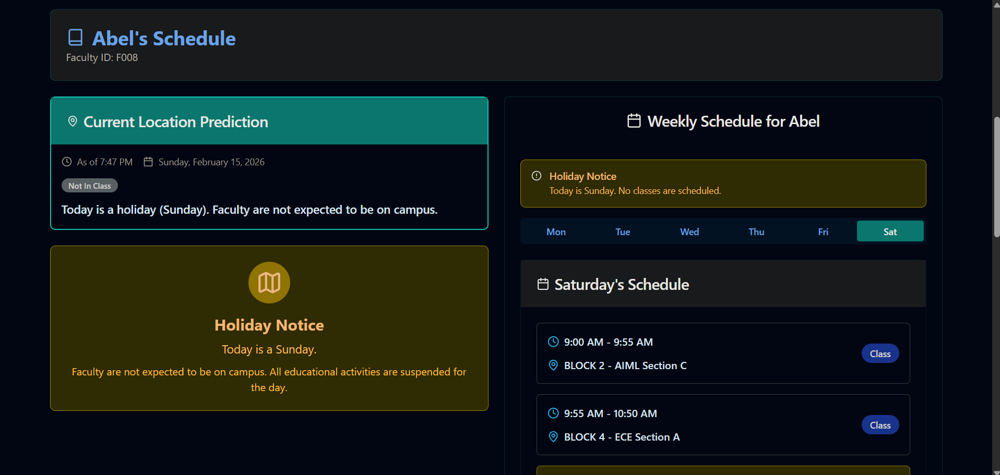

# 🎓 Campus Faculty Locator Pro

> A modern, real-time faculty tracking system built with React, TypeScript, and Tailwind CSS

[](https://reactjs.org/)
[](https://www.typescriptlang.org/)
[](https://vitejs.dev/)
[](https://tailwindcss.com/)

## ✨ Overview

Campus Faculty Locator Pro is a comprehensive web application designed to help students quickly locate faculty members across campus. The system provides real-time location tracking based on schedules, interactive campus maps, and detailed faculty information.

## 📸 Screenshots

### Home Page - Faculty Search

*Main interface with faculty search and available faculty list*

### Add Faculty Member

*Auto-generate or create custom faculty schedules*

### Custom Schedule Builder

*Build detailed weekly schedules with time slots and locations*

### Faculty Schedule View

*Real-time location prediction and weekly schedule display*

## 🚀 Features

### Core Functionality
- 🔍 **Smart Faculty Search** - Search by name or faculty ID
- 📍 **Real-time Location Tracking** - Know where faculty are right now based on their schedule
- 📅 **Weekly Schedule Management** - View complete weekly timetables
- 🗺️ **Interactive Campus Map** - Visual campus block navigation
- 🎯 **Current Location Prediction** - Schedule-based location estimation
- 🏫 **Holiday Detection** - Automatic holiday notifications

### Faculty Management
- ➕ **Add New Faculty** - Easy faculty member registration
- 🤖 **Auto-Generate Schedules** - Automatically create schedules based on common academic patterns
- ✏️ **Custom Schedule Builder** - Manual schedule creation with detailed time slots
- 📊 **Department & Building Organization** - Structured data management

### User Experience
- 🎨 **Beautiful UI** - Modern design with shadcn/ui components
- 📱 **Responsive Design** - Works on desktop, tablet, and mobile
- 🌙 **Dark Mode** - Eye-friendly dark theme
- ⚡ **Fast Performance** - Lightning-fast with Vite
- 🔔 **Toast Notifications** - Real-time feedback

## 🛠️ Tech Stack

### Frontend
- **React 18** - Modern UI library
- **TypeScript 5** - Type-safe development
- **Vite 5** - Next-generation build tool
- **React Router 6** - Client-side routing

### UI & Styling
- **Tailwind CSS 3** - Utility-first CSS framework
- **shadcn/ui** - High-quality React components
- **Radix UI** - Accessible component primitives
- **Lucide React** - Beautiful icon library

### Backend & Data
- **Supabase** - Backend as a Service
- **TanStack Query** - Powerful data fetching
- **React Hook Form** - Performant form handling
- **Zod** - TypeScript-first schema validation

### Development Tools
- **ESLint** - Code linting
- **PostCSS** - CSS processing
- **Autoprefixer** - CSS vendor prefixes

## 📋 Prerequisites

- Node.js 18.0 or higher
- npm or yarn package manager

## 🚀 Quick Start

### 1. Clone the Repository

```bash
git clone https://github.com/YOUR_USERNAME/campus-faculty-locator-pro.git
cd campus-faculty-locator-pro
```

### 2. Install Dependencies

```bash
npm install
```

### 3. Set Up Environment Variables

Create a `.env.local` file in the root directory:

```env
VITE_SUPABASE_URL=your_supabase_project_url
VITE_SUPABASE_ANON_KEY=your_supabase_anon_key
```

### 4. Start Development Server

```bash
npm run dev
```

Open [http://localhost:8080](http://localhost:8080) in your browser.

## 📜 Available Scripts

```bash
# Start development server
npm run dev

# Build for production
npm run build

# Preview production build
npm run preview

# Run linter
npm run lint

# Fix linting issues
npm run lint:fix
```

## 📁 Project Structure

```
campus-faculty-locator-pro/
├── src/
│   ├── components/          # React components
│   │   ├── ui/             # shadcn/ui components
│   │   ├── AddFacultyForm.tsx
│   │   ├── CampusBlockMap.tsx
│   │   ├── DailySchedule.tsx
│   │   ├── FacultyLocationBox.tsx
│   │   ├── FacultyLocatorLogo.tsx
│   │   ├── FacultySearch.tsx
│   │   ├── ScheduleBuilder.tsx
│   │   └── WeeklySchedule.tsx
│   │
│   ├── pages/              # Page components
│   │   ├── Index.tsx
│   │   └── NotFound.tsx
│   │
│   ├── utils/              # Utility functions
│   │   ├── facultyData.ts
│   │   └── types.ts
│   │
│   ├── lib/                # Library utilities
│   │   └── utils.ts
│   │
│   ├── hooks/              # Custom React hooks
│   │   ├── use-mobile.tsx
│   │   └── use-toast.ts
│   │
│   └── integrations/       # External integrations
│       └── supabase/       # Supabase client
│
├── public/                 # Static assets
├── config files/           # Configuration backups
└── ...
```

## 🎨 Customization

### Add Faculty Data

Edit `src/utils/facultyData.ts`:

```typescript
{
  id: "F001",
  name: "Dr. John Smith",
  department: "Computer Science",
  email: "john.smith@university.edu",
  phone: "+1234567890",
  schedule: {
    // Weekly schedule here
  }
}
```

### Modify Theme Colors

Edit `tailwind.config.ts`:

```typescript
colors: {
  faculty: {
    primary: '#1e40af',    // Deep blue
    secondary: '#0ea5e9',  // Light blue
    accent: '#0d9488',     // Teal
  }
}
```

### Update Campus Buildings

Modify building data in `src/components/CampusBlockMap.tsx` or `src/utils/facultyData.ts`.


## 🔐 Environment Variables

| Variable | Description | Required |
|----------|-------------|----------|
| `VITE_SUPABASE_URL` | Supabase project URL | Yes* |
| `VITE_SUPABASE_ANON_KEY` | Supabase anonymous key | Yes* |

*Required only if using Supabase features


## 📝 License

This project is licensed under the MIT License - see the [LICENSE](LICENSE) file for details.

## 👨‍💻 Authors


- [Y.Shanthan](https://github.com/shanthan5589)
- [K.Mani Chandra](https://github.com/mani-chandra-k)

## 🙏 Acknowledgments

- Built with [Lovable](https://lovable.dev)
- UI components from [shadcn/ui](https://ui.shadcn.com)
- Icons from [Lucide](https://lucide.dev)
- Styled with [Tailwind CSS](https://tailwindcss.com)
